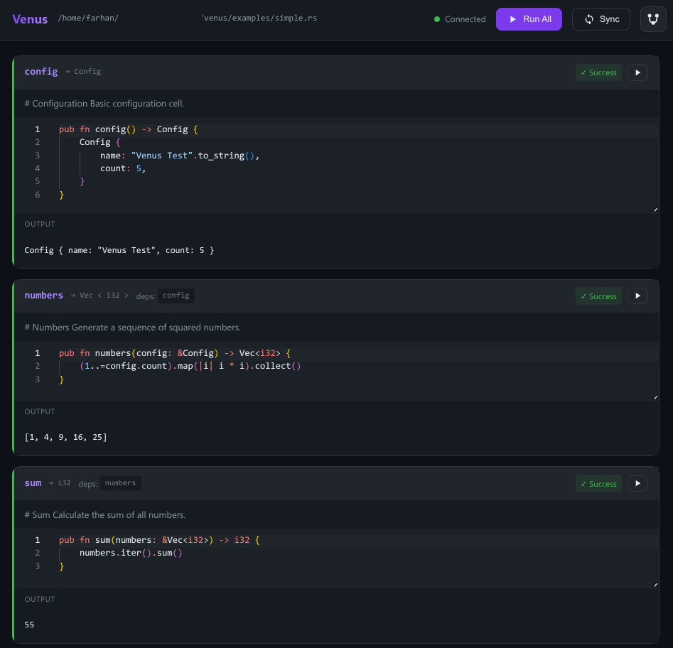
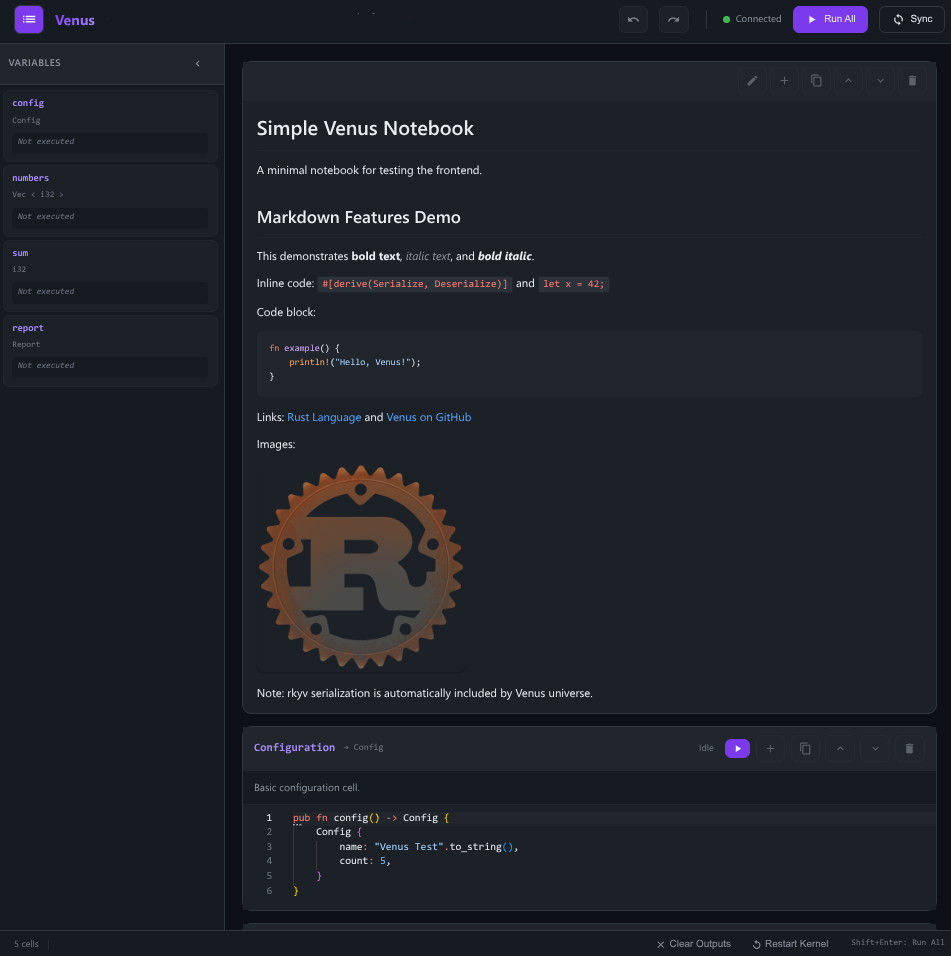

# Venus


A reactive notebook environment for Rust.

[](LICENSE)

## What is Venus?

Venus lets you write Rust notebooks as regular `.rs` files with full IDE support. Cells are functions marked with `#[venus::cell]`, and dependencies between cells are automatically inferred from function parameters.



## ⚠️ Security Warning

**Venus executes arbitrary Rust code with full system access.**

- ✅ **Safe for**: Local development, testing, learning
- ❌ **NOT safe for**: Production, shared servers, untrusted code
- 🔒 **Cloud deployments**: Providers MUST use containers/VMs for isolation

Venus provides NO sandboxing. Cells can access files, network, and spawn processes.
**You are responsible for running Venus in a secure environment.**

See [SECURITY.md](SECURITY.md) for details.

## Features

- **Interactive web UI** - Monaco editor with syntax highlighting, cell outputs, and execution status
- **Native Rust files** - Write notebooks as `.rs` files with full rust-analyzer support
- **Reactive dependency tracking** - Dependent cells marked dirty when upstream changes
- **Fast compilation** - Cranelift JIT backend with smart caching (only recompiles when source changes)
- **Hot reload** - Run modified cells instantly without losing state from other cells
- **Markdown cells** - Full markdown support with syntax highlighting, images, and links
- **Interactive widgets** - Sliders, text inputs, dropdowns, and checkboxes
- **Rich output** - Render HTML, images, tables, and custom formats
- **Jupyter export** - Generate `.ipynb` files for GitHub preview

### Markdown Support

Venus supports rich markdown cells with full GitHub Flavored Markdown syntax:



- **Text formatting** - Bold, italic, code blocks with syntax highlighting
- **Links and images** - External URLs and embedded images
- **Code blocks** - Multi-language syntax highlighting
- **Lists and tables** - Organized documentation

## Quick Start

```bash
# Install Venus
cargo install venus-cli

# Create a new notebook (adds to Cargo.toml for LSP support)
venus new my_notebook

# Or create as workspace member
venus new my_notebook --workspace

# Run the notebook
venus run my_notebook.rs

# Start the interactive server
venus serve my_notebook.rs
```

Venus automatically creates/updates `Cargo.toml` to enable rust-analyzer LSP support.

Then open `http://localhost:8080` in your browser.

## Example

```rust
use venus::prelude::*;

/// Configuration for the analysis
#[venus::cell]
pub fn config() -> Config {
    Config { count: 10 }
}

/// Generate squared numbers
#[venus::cell]
pub fn numbers(config: &Config) -> Vec<i32> {
    (1..=config.count).map(|i| i * i).collect()
}

/// Calculate the sum
#[venus::cell]
pub fn total(numbers: &Vec<i32>) -> i32 {
    numbers.iter().sum()
}
```

## CLI Commands

| Command                   | Description                  |
| ------------------------- | ---------------------------- |
| `venus run <notebook>`    | Execute notebook headlessly  |
| `venus serve <notebook>`  | Start interactive web server |
| `venus sync <notebook>`   | Generate `.ipynb` file       |
| `venus build <notebook>`  | Build standalone binary      |
| `venus new <name>`        | Create new notebook          |
| `venus export <notebook>` | Export to standalone HTML    |
| `venus watch <notebook>`  | Auto-run on file changes     |

## Documentation

See the [docs](docs/) directory for detailed documentation:

- [Installation](docs/installation.md) - Platform-specific setup instructions
- [Getting Started](docs/getting-started.md) - Create your first notebook
- [How It Works](docs/how-it-works.md) - Internal execution model and architecture
- [API Reference](docs/api.md) - Build custom frontends
- [Deployment](docs/deployment.md) - Production deployment options
- [Cells](docs/cells.md) - Cell syntax and dependencies
- [Widgets](docs/widgets.md) - Interactive inputs
- [CLI Reference](docs/cli.md) - Command-line interface
- [Render Trait](docs/render.md) - Custom output formatting
- [API Stability](STABILITY.md) - Versioning and breaking change policy

## Contributing

Contributions are welcome! Please feel free to submit issues and pull requests.

## License

Licensed under the Apache License, Version 2.0. See [LICENSE](LICENSE) for details.
