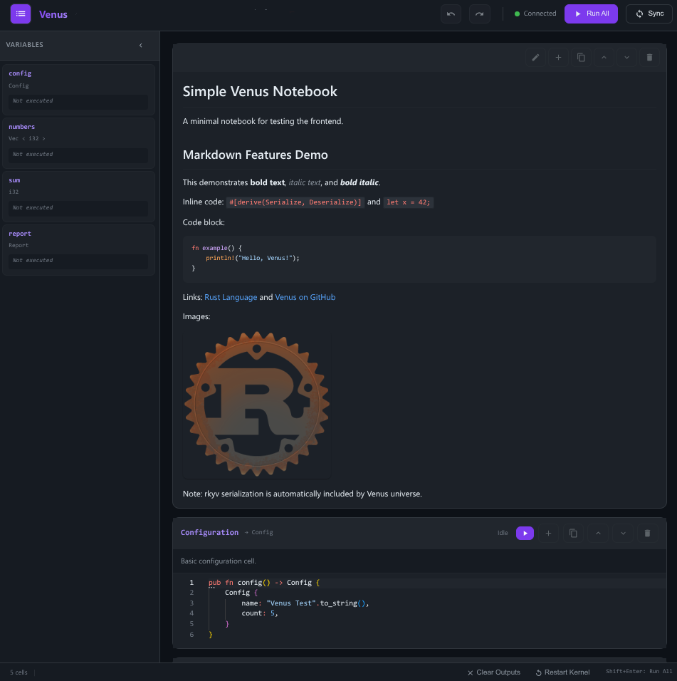

# Cells

Cells are the building blocks of Venus notebooks. Each cell is a function marked with `#[venus::cell]`.

## Basic Syntax

```rust
/// Cell description (shown in UI)
#[venus::cell]
pub fn cell_name() -> ReturnType {
    // Cell body
}
```

## Dependencies

Dependencies are inferred from function parameters:

```rust
#[venus::cell]
pub fn config() -> i32 {
    42
}

#[venus::cell]
pub fn doubled(config: &i32) -> i32 {
    config * 2
}
```

When `config` is run, `doubled` is marked dirty (yellow) and needs manual execution.

### Parameter Matching

Parameters must match the return type of the dependency:

| Dependency returns | Parameter type |
| ------------------ | -------------- |
| `i32`              | `&i32`         |
| `String`           | `&String`      |
| `Vec<T>`           | `&Vec<T>`      |
| `CustomType`       | `&CustomType`  |

## Workspace Notebooks

Venus reads the nearest parent `Cargo.toml` for each notebook. Package notebooks inherit declared normal dependencies and target dependencies. Both interactive execution and standalone builds use this context.

Workspace members expand `workspace = true` from their owning workspace. Unused entries in `workspace.dependencies` stay excluded. Notebooks beneath a virtual workspace root use its dependency catalog.

```toml
# Workspace Cargo.toml
[workspace]
members = ["analysis", "internal-model"]

[workspace.dependencies]
model = { package = "internal-model", path = "internal-model", default-features = false }
```

```toml
# analysis/Cargo.toml
[package]
name = "analysis"
version = "0.1.0"
edition = "2021"

[dependencies]
model.workspace = true
```

```rust
// analysis/notebooks/report.rs
#[venus::cell]
pub fn answer() -> i32 {
    model::answer()
}
```

Notebook `cargo` blocks override matching dependency aliases. Paths in those blocks resolve from the notebook directory. Member dependency paths resolve from the member directory. Inherited dependency paths and root patch paths resolve from the workspace directory.

````rust
//! ```cargo
//! [dependencies.model]
//! package = "internal-model"
//! path = "../../alternate-model"
//! features = ["reporting"]
//! ```
````

- **Aliases and sources:** Cargo package aliases, Git selectors, registry selectors, and root patches survive generation.
- **Features:** Feature arrays, disabled defaults, optional dependencies, and feature activation graphs retain Cargo semantics.
- **Targets:** Target dependencies keep their target conditions. Dependency exports follow target and optional feature activation.
- **Runtime dependencies:** Venus requires compatible `venus`, `rkyv`, and `serde_json` aliases. Compatible additional features survive generation. Conflicting packages or sources return contextual errors.
- **Cache:** Manifest changes invalidate dependency hashes. Local dependency and patch paths bypass universe caching and refresh compiled cells after reloads.
- **Isolation:** Generated Cargo projects contain their own `[workspace]` table.

## Doc Comments

Doc comments become cell descriptions:

```rust
/// # Configuration
///
/// This cell defines the analysis parameters.
/// Values can be adjusted to tune the results.
#[venus::cell]
pub fn config() -> Config {
    Config::default()
}
```

Markdown formatting is supported in the web UI.

## Markdown Cells

Venus supports dedicated markdown cells using Rust doc comments (`//!` for module-level or `///` for item-level):

````rust
//! # Simple Venus Notebook
//!
//! A minimal notebook for testing the frontend.
//!
//! ## Markdown Features Demo
//!
//! This demonstrates **bold text**, *italic text*, and ***bold italic***.
//!
//! Inline code: `#[derive(Serialize, Deserialize)]` and `let x = 42;`
//!
//! Code block:
//! ```rust
//! fn example() {
//!     println!("Hello, Venus!");
//! }
//! ```
//!
//! Links: [Rust Language](https://www.rust-lang.org/)
//!
//! Images: 
````

### Supported Markdown Features



Venus supports full GitHub Flavored Markdown (GFM):

- **Text formatting** - Bold (`**bold**`), italic (`*italic*`), and combined (`***both***`)
- **Inline code** - Backticks for `inline code` with syntax highlighting
- **Code blocks** - Fenced code blocks with language-specific syntax highlighting
- **Links** - External and internal links: `[Text](https://example.com)`
- **Images** - Embedded images: ``
- **Lists** - Ordered and unordered lists
- **Tables** - GitHub-style tables
- **Blockquotes** - Quote blocks with `>`
- **Headers** - H1-H6 headers with `#` syntax

### Editing Markdown Cells

In the web UI, markdown cells can be:

- **Edited** - Click the edit button to modify content
- **Inserted** - Add new markdown cells anywhere in the notebook
- **Copied** - Duplicate markdown cells
- **Moved** - Reorder cells with up/down buttons
- **Deleted** - Remove unwanted cells

All changes are immediately saved to the `.rs` source file.

## Custom Types

Define your own types for cell outputs:

```rust
#[derive(Debug, Clone, Serialize, Deserialize)]
pub struct Report {
    pub title: String,
    pub values: Vec<f64>,
}

#[venus::cell]
pub fn report(data: &Vec<f64>) -> Report {
    Report {
        title: "Analysis".to_string(),
        values: data.clone(),
    }
}
```

Types must derive `Serialize` and `Deserialize` (Venus transforms these to rkyv for efficient serialization).

## Execution Order

Cells execute in topological order based on dependencies:

```
config -> numbers -> doubled
              \-> tripled
                     \-> combined
```

Independent cells at the same level can run in parallel.

## Hot Reload

When you run a cell:

1. Only that cell recompiles (if source changed - smart caching)
2. Dependent cells are marked dirty (yellow) if output changed
3. State from unaffected cells is preserved
4. Compilation uses Cranelift for speed

**Note**: Cells are never auto-executed. Dirty marking is visual feedback only - you control when to re-run cells.

For detailed execution flow and state lifecycle, see [How It Works](how-it-works.md)

## Best Practices

- Keep cells focused on a single task
- Use meaningful names that describe the output
- Add doc comments for complex logic
- Prefer immutable references (`&T`) for parameters
