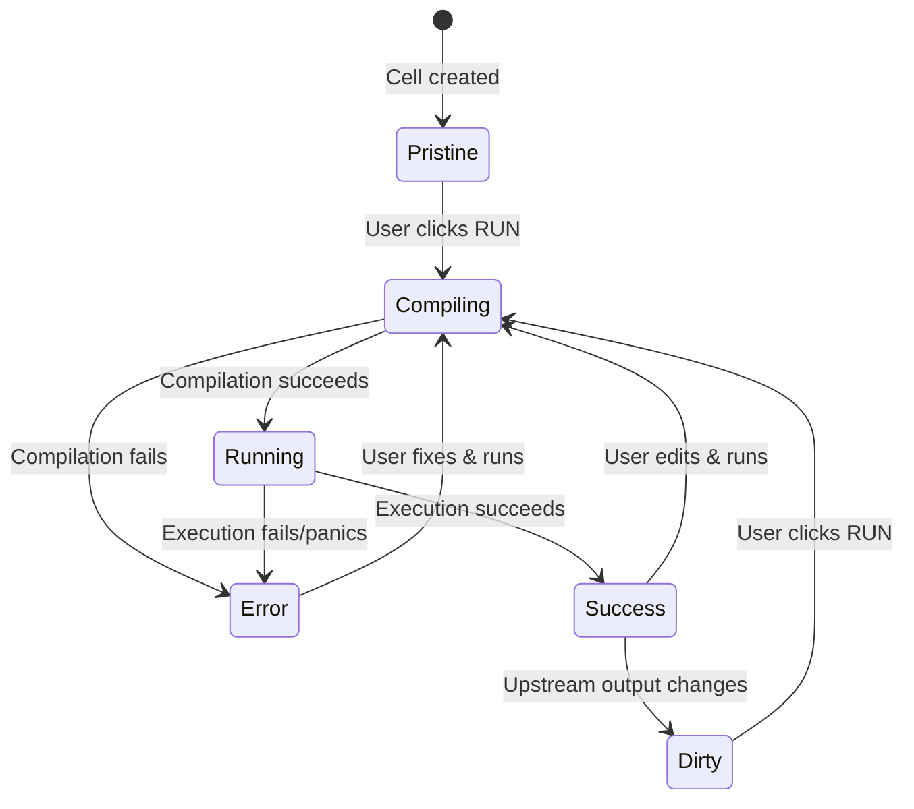
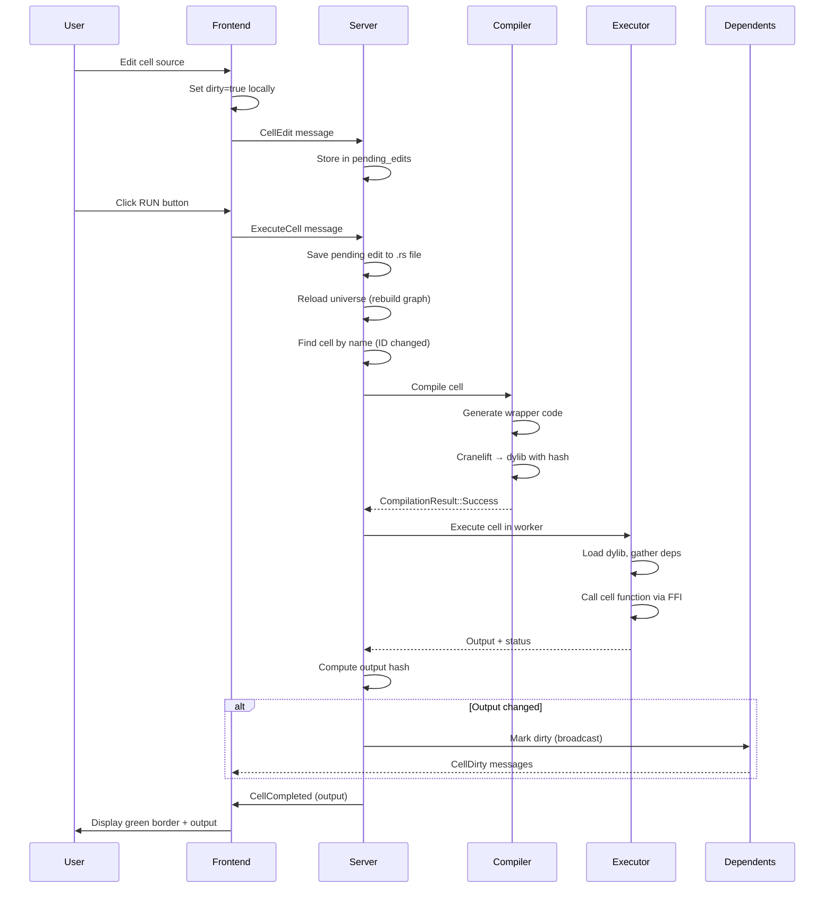
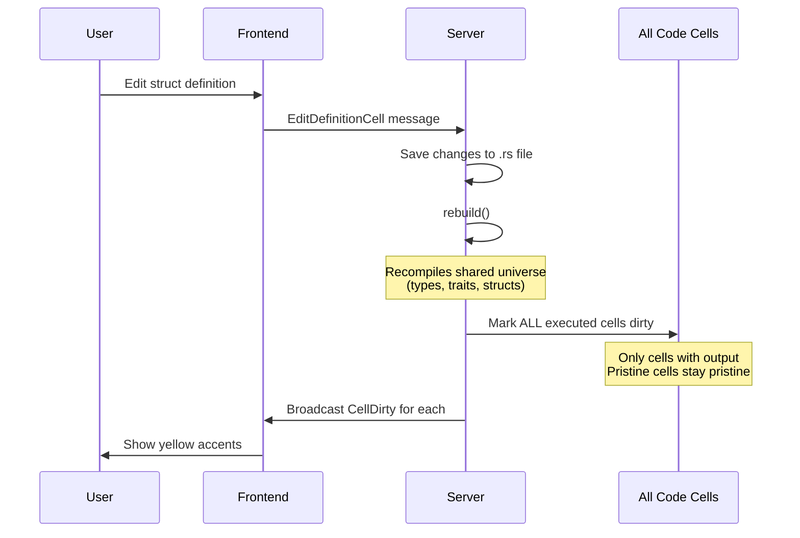

# How Venus Works

This document explains Venus's internal execution model and behavior. For user-facing documentation, see [Getting Started](getting-started.md) and [FAQ](FAQ.md).

## Table of Contents

- [Cell State Lifecycle](#cell-state-lifecycle)
- [Execution Flow](#execution-flow)
- [Pristine vs Dirty States](#pristine-vs-dirty-states)
- [Output-Based Change Detection](#output-based-change-detection)
- [Definition Cell Behavior](#definition-cell-behavior)
- [Compilation Pipeline](#compilation-pipeline)

## Cell State Lifecycle

Venus cells transition through multiple states during their lifecycle:



### State Descriptions

| State | Visual | Meaning |
|-------|--------|---------|
| **Pristine** | No border | Never executed, optional to run |
| **Compiling** | Gray indicator | Cranelift compiling cell to dylib |
| **Running** | Purple border | Executing in worker process |
| **Success** | Green border | Last execution succeeded, output cached |
| **Dirty** | Green border + yellow accent | Has output but needs re-execution |
| **Error** | Red border | Compilation or execution failed |

**Key insight**: Pristine cells remain pristine even when upstreams change. Only cells with cached output become dirty.

## Execution Flow

When a user edits a cell and clicks RUN:



### Step-by-Step Breakdown

1. **Edit Phase** (User types in Monaco):
   - Frontend sets `dirty=true` locally
   - Sends `CellEdit` → stored in `pending_edits` map
   - **Not saved to disk yet**

2. **Execution Phase** (User clicks RUN):
   - Save pending edit to `.rs` file
   - Call `reload()` → rebuilds dependency graph (new cell IDs)
   - Find cell by name (stable identifier across reloads)
   - Check dependencies have output (prevent missing dep errors)

3. **Compilation Phase**:
   - Generate wrapper code with proper imports
   - Compile with Cranelift to dylib
   - **Filename includes source hash**: `libcell_config_a3f5c2d1.so`
   - Cleanup old dylibs with same cell name but different hash

4. **Execution Phase**:
   - Register cell with `ProcessExecutor` (isolated worker)
   - Gather dependency outputs in correct order
   - Load dylib via FFI, call cell function
   - Capture output or panic message

5. **Dirty Propagation**:
   - Compute hash of new output
   - Compare with hash of previous output (if any)
   - If different → mark dependents dirty
   - Broadcast `CellDirty` messages to frontend

## Pristine vs Dirty States

Venus makes a critical distinction between pristine and dirty cells:

### Pristine Cells

**Definition**: Cell has never been executed (`output = None`)

**Behavior**:
- No colored border
- Does NOT become dirty when upstreams change
- Optional to execute (user decides if needed)
- No cascade effect through dependency chain

**Example**:
```
config (Success) → numbers (Pristine) → total (Pristine)
```

If you edit `config` and run it:
- `config`: Success (green border)
- `numbers`: **Stays Pristine** (no border)
- `total`: **Stays Pristine** (no border)

### Dirty Cells

**Definition**: Cell has cached output but upstream changed (`output = Some(...)`, `dirty = true`)

**Behavior**:
- Green border + yellow left accent (CSS: `border-left: 3px solid var(--warning)`)
- Indicates output is stale
- Should be re-run to see updated results
- Does NOT auto-execute (user control)

**Example**:
```
config (Success) → numbers (Success) → total (Success)
```

If you edit `config` and run it:
- `config`: Success (green, clean)
- `numbers`: **Dirty** (green + yellow accent)
- `total`: **Stays Success** (green, clean) ← Not transitively dirty

**Why not transitive?**
Because `numbers` hasn't been re-run yet. Once you run `numbers`:
- If `numbers` output changed → `total` becomes Dirty
- If `numbers` output unchanged → `total` stays Success (clean)

This prevents unnecessary re-execution cascades.

## Output-Based Change Detection

Venus uses **output hash comparison** to minimize dirty propagation:

### The Problem

Without output hashing:
```rust
#[venus::cell]
pub fn config() -> i32 { 42 }  // Edit: change from 41 to 42

#[venus::cell]
pub fn doubled(config: &i32) -> i32 { config * 2 }
```

If you edit `config` source (even without changing value), should `doubled` be marked dirty?

**Naive approach**: Yes, always mark dependents dirty on source change
**Venus approach**: Only if output actually changed

### The Solution

Implementation in `session.rs:execute_cell()`:

```rust
// After successful execution
let output_hash = compute_hash(&new_output);
let previous_hash = self.cell_outputs.get(&cell_id).map(|o| compute_hash(o));

let output_changed = match previous_hash {
    Some(prev) => prev != output_hash,
    None => true,  // First execution
};

if output_changed {
    // Only mark dependents dirty if output actually changed
    let dirty_cells = self.mark_dependents_dirty_and_get(cell_id);
    for dirty_id in dirty_cells {
        self.broadcast(ServerMessage::CellDirty { cell_id: dirty_id });
    }
}
```

### Benefits

1. **Avoid spurious re-runs**: Changing comments or formatting doesn't dirty dependents
2. **Idempotent cells**: Re-running a cell with same inputs doesn't dirty cascade
3. **Smart caching**: Only recomputes what actually needs updating

### Example Scenario

```rust
#[venus::cell]
pub fn data() -> Vec<i32> {
    // Changed comment but same output
    vec![1, 2, 3, 4, 5]
}

#[venus::cell]
pub fn sum(data: &Vec<i32>) -> i32 {
    data.iter().sum()
}
```

Timeline:
1. Run `data` → output: `[1,2,3,4,5]`, hash: `0xabc123`
2. Run `sum` → output: `15`
3. Edit `data` (add comment), run again → output: `[1,2,3,4,5]`, hash: `0xabc123`
4. **Result**: `sum` stays Success (clean), not marked dirty!

## Definition Cell Behavior

Definition cells (structs, traits, enums, type aliases) have special behavior:

### What Are Definition Cells?

Any top-level item that's NOT a `#[venus::cell]` function:

```rust
// Definition cells (not executable)
pub struct Config {
    pub name: String,
    pub count: usize,
}

pub trait Processor {
    fn process(&self, data: &[u8]) -> Vec<u8>;
}

pub enum Status {
    Running,
    Completed,
}

// Code cell (executable)
#[venus::cell]
pub fn config() -> Config {
    Config { name: "test".into(), count: 10 }
}
```

### Visual Distinction

- **Definition cells**: Blue left border, NO status indicator, not executable
- **Code cells**: Status-based border (green/yellow/red), executable via RUN button

### Editing Definition Cells

When you edit a definition cell (struct, trait, etc.) and save:



**Why mark ALL cells dirty?**

Type changes can affect any code, even without direct dependencies:

```rust
// Before
pub struct Config {
    pub count: usize,
}

// After: Add field
pub struct Config {
    pub count: usize,
    pub name: String,  // New field
}

#[venus::cell]
pub fn analysis() -> Report {
    // This cell doesn't use Config at all
    // But its compiled code may be affected by type layout changes
    Report { data: vec![1, 2, 3] }
}
```

Implementation in `session.rs:edit_definition_cell()`:

```rust
// Rebuild universe (shared library with definitions)
self.reload()?;

// Mark ALL cells with output as dirty
let dirty_cells: Vec<CellId> = self.cells.iter()
    .filter(|c| self.cell_outputs.contains_key(&c.id))  // Only executed cells
    .map(|c| c.id)
    .collect();

for &cell_id in &dirty_cells {
    if let Some(state) = self.cell_states.get_mut(&cell_id) {
        state.set_dirty(true);
    }
    self.broadcast(ServerMessage::CellDirty { cell_id });
}
```

**Note**: Definition cell edits do NOT auto-execute any cells. User must manually re-run dirty cells.

## Compilation Pipeline

Venus uses a two-backend compilation strategy:

### Development Mode (Default)

**Backend**: Cranelift JIT
**Speed**: ~100-500ms per cell
**Performance**: 1.5-3x slower than LLVM at runtime
**Use case**: Interactive development

```
Rust source → rustc_codegen_cranelift → dylib with hash → FFI load
```

### Release Mode

**Backend**: LLVM
**Speed**: ~3-15s per cell
**Performance**: Fully optimized native code
**Use case**: Production runs, benchmarks

```
Rust source → rustc (LLVM) → optimized dylib → FFI load
```

### Dylib Naming Strategy

**Problem**: Linux `dlopen()` caches shared libraries by path

If cell source changes but dylib path stays the same:
```
libcell_config.so  (v1: returns 10)
libcell_config.so  (v2: returns 20)  ← dlopen() returns CACHED v1!
```

**Solution**: Include source hash in filename

```rust
let source_hash = compute_hash(&cell.source);
let dylib_name = format!("libcell_{}_{:x}.so", cell.name, source_hash);
```

Example progression:
```
libcell_config_a3f5c2d1.so  (source: "42")
libcell_config_7b2e9f44.so  (source: "43")
libcell_config_a3f5c2d1.so  (source: "42" again) ← Reuses first
```

**Cleanup**: Before compiling, Venus deletes old dylibs:

```rust
// Delete all dylibs for this cell except the one we're about to create
let cell_prefix = format!("libcell_{}_", cell.name);
for entry in fs::read_dir(&build_dir)? {
    let name = entry.file_name();
    if name.starts_with(&cell_prefix) && name != dylib_name {
        fs::remove_file(entry.path())?;
    }
}
```

This prevents build directory accumulation while maintaining cache hits for unchanged cells.

### Smart Caching

Venus recompiles a cell only if:
1. Source code changed (detected via hash)
2. Dependency signatures changed (detected via universe rebuild)
3. No cached dylib exists for this source hash

If you edit cell A and run it, then edit cell B:
- Cell A: Cached dylib reused (no recompile)
- Cell B: New dylib compiled
- Dependent cells: Cached dylibs reused until marked dirty and re-run

## Key Takeaways

1. **Manual Execution**: Venus NEVER auto-executes cells. Dirty marking is visual feedback only.

2. **Pristine Preservation**: Cells without output don't participate in dirty propagation. This prevents cascades through unused dependency chains.

3. **Output-Based Dirtying**: Dependents marked dirty only if output hash changes, not just on source recompile.

4. **Definition Cell Scope**: Editing types/traits marks ALL executed cells dirty (conservative approach for type safety).

5. **Compilation Caching**: Source hash-based dylib naming enables aggressive caching while forcing fresh loads on changes.

6. **State Across Reloads**: Cell outputs preserved across `reload()` by mapping via cell names (stable identifiers).

This design gives users **explicit control** over execution while providing **smart dependency tracking** to minimize unnecessary work.
